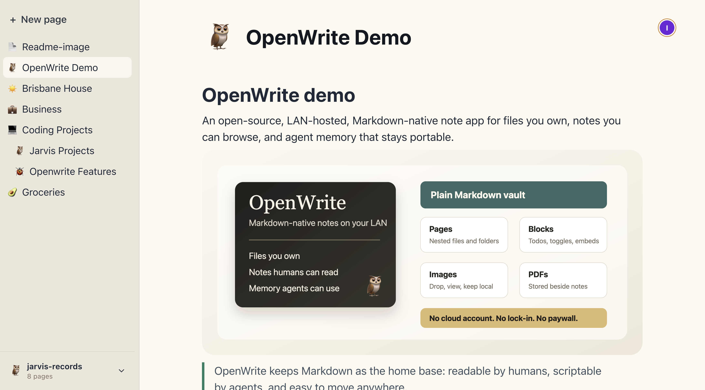

# OpenWrite

OpenWrite is an open-source, LAN-hosted, Markdown-native note app.

It gives you a Notion-ish editing surface on top of files you actually own: plain Markdown pages, local attachments, Obsidian-style vault structure, and browser/PWA access from your Mac, iPhone, or any trusted device on your LAN.



> Status: early alpha. OpenWrite is for trusted local networks and local vaults, not internet-exposed hosting.

> Agents: start with [AGENTS.md](AGENTS.md). Humans: this README is the map.

## Install

OpenWrite has two pieces:

1. **The OpenWrite server** runs on one computer on your LAN. This is where the repo, backend, browser frontend, and Markdown vault live.
2. **The apps on your devices** connect to that server. On a Mac, use the DMG from GitHub Releases. On iPhone, save the LAN URL to your Home Screen as a PWA.

Most updates happen by pulling a newer OpenWrite server version. The Mac app is a thin wrapper around the LAN-hosted frontend, so it should only need occasional updates.

### Give This To Your Agent

OpenWrite is designed to be installed and operated with an AI coding agent. Start by asking your agent to install and run the server:

```text
Install and start OpenWrite from GitHub:
https://github.com/kabuika96/openwrite

Goals:
- Do not stop unrelated running apps or services.
- Clone the repo from https://github.com/kabuika96/openwrite.git.
- Install dependencies with npm.
- Copy .env.example to .env if .env does not exist.
- Start the app with npm run dev.
- Confirm the backend health endpoint works.
- Tell me the local URL, LAN URL, frontend port, and backend port.
- Help me create or open a Markdown vault on first run.

Useful commands:
- git clone https://github.com/kabuika96/openwrite.git
- cd openwrite
- npm install
- cp .env.example .env
- npm run dev
- curl -fsS http://127.0.0.1:8787/api/health
```

That is the preferred path. The agent can pull the repo, handle ports, preserve existing processes, read logs, share the right browser URL, and walk through first-run vault setup while you stay focused on the app.

### Manual Server Install

```sh
git clone https://github.com/kabuika96/openwrite.git
cd openwrite
npm install
cp .env.example .env
npm run dev
```

Open `http://127.0.0.1:5173`. Vite will also print a LAN URL when one is available.

The frontend proxies API requests and WebSockets to the backend at `http://127.0.0.1:8787`.

### Install The App On Your Devices

After the server is running, connect your devices to the LAN URL your agent or terminal prints, for example `http://10.0.0.158:5173`.

On Mac:

1. Download the latest `OpenWrite-*-universal.dmg` from [GitHub Releases](https://github.com/kabuika96/openwrite/releases).
2. Open the DMG.
3. Drag `OpenWrite.app` into `/Applications`.
4. Launch OpenWrite and enter your server's LAN URL.

On iPhone or iPad:

1. Open the LAN URL in Safari.
2. Tap Share.
3. Tap Add to Home Screen.
4. Launch OpenWrite from the Home Screen icon.

The Mac app does not start the server; it replaces opening the LAN-hosted frontend in a browser. Desktop releases are unsigned developer builds, and desktop wrapper updates are manual. See [docs/DESKTOP_RELEASE.md](docs/DESKTOP_RELEASE.md).

For desktop app development:

```sh
npm run dev --workspace desktop
```

Unsigned desktop packages can be built with:

```sh
npm run package:desktop
```

## Why I Built OpenWrite

A few weeks ago, I had OpenClaw and Hermes running 24/7 on a spare MacBook.

The agents were working with files I actually cared about: Markdown notes, PDFs, images, Notion-style pages, etc. I needed one place for those files to live, stay easy to browse, and be editable from my Mac, my iPhone, or whatever device was nearby.

Notion was not it. I had already hit the walls there: lock-in, storage limits, collaboration limits, and pricing gates around things that felt basic. I did not want my files or agent memory trapped in someone else's product.

Obsidian got closer. Local Markdown, plain files, no weird database hostage situation. But my setup was server-first: the files lived on the always-on agent Mac, and I wanted to reach them from other devices on my LAN. Obsidian also is not open source, so it was not the thing I wanted to bend into this shape.

So I built OpenWrite.

The goal is simple:

- files you own
- real Markdown editing
- Media viewing
- browser/PWA access from LAN devices
- no cloud account
- no vendor lock-in
- no storage or collaboration paywalls
- friendly to Obsidian-style vaults
- useful for both humans and agents

Markdown is the home base. Files stay portable. The system stays boring where it should be boring, and hackable where it should be hackable.

PRs welcome.

## Requirements

- Node.js 22.12 or newer
- npm 10 or newer

## Configuration

OpenWrite reads backend runtime configuration from environment variables and from a root `.env` file when it exists. The frontend dev server also reads the root `.env` file.

Start from [.env.example](.env.example):

```sh
cp .env.example .env
```

The most common settings are:

- `OPENWRITE_BACKEND_PORT`: backend API and WebSocket port.
- `OPENWRITE_STATE_PATH`: local app-state file that remembers recent vaults.
- `OPENWRITE_VAULT_PATH`: optional vault path to open automatically on startup.
- `OPENWRITE_ALLOWED_HOSTS`: optional comma-separated hostnames accepted by Vite during LAN development.

## Local Data

The repo-level `data/` directory is ignored except for `data/.gitkeep`. It may contain local app state, Yjs cache files, and scratch vaults during development.

Your selected vault is normal local content. Do not commit personal vaults, attachments, `.env` files, or generated cache files.

## Architecture

The short version:

```text
Browser PWA
  -> React app shell
  -> Tiptap/Yjs page editor
  -> Vite proxy
  -> Node Hocuspocus server
  -> Markdown vault files + attachment files
```

See [docs/ARCHITECTURE.md](docs/ARCHITECTURE.md) and the ADRs in [docs/adr](docs/adr) for the project shape and persistence decisions.

## Development

```sh
npm run check
npm run test
npm run build
npm run package:desktop
```

See [CONTRIBUTING.md](CONTRIBUTING.md) for local setup, checks, and pull request expectations.

## Security

OpenWrite is designed for trusted local networks. See [SECURITY.md](SECURITY.md) before exposing it beyond your own machine or LAN.

## License

MIT. See [LICENSE](LICENSE).
